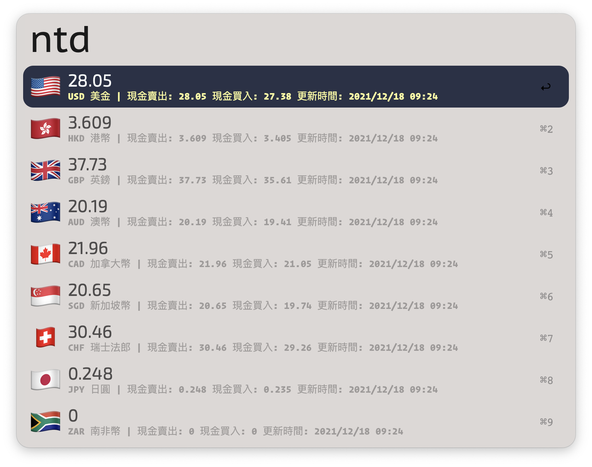

# Alfred NTD Exchange

> [Alfred](https://alfredapp.com) workflow for fetch NTD Foreign Exchange Rate from BOT(Bank Of Taiwan)



## Install

```
npm i -g alfred-ntd-exchange
```

*Requires [Node.js 9+](https://nodejs.org/) and the Alfred [Powerpack](https://www.alfredapp.com/powerpack/).*

## Usage

type `ntd` listing NTD Foreign Exchange.
